# Solari Hub Demand Forecasting

This project predicts how many orders each of 1,115 Solari micro-fulfillment hubs will receive
on each day of a future 42-day window (2015-06-20 to 2015-07-31). It is a Kaggle-style
competition entry scored with RMSLE. The whole solution lives in one Jupyter notebook,
[solari-hub-demand-forecasting.ipynb](solari-hub-demand-forecasting.ipynb), built from
gradient-boosted trees (XGBoost and CatBoost) trained on two GPUs. No deep learning is used.

The competition brief, data dictionary and rules are in [AGENTS.md](AGENTS.md).

All numbers, charts and file names in this README come from the committed run
`20260925_075244`, stored in [solari_forecast/](solari_forecast/).

## Table of contents

- [Results at a glance](#results-at-a-glance)
- [Quick start](#quick-start)
- [The problem in simple words](#the-problem-in-simple-words)
- [The data](#the-data)
- [Repository structure](#repository-structure)
- [How the notebook works, end to end](#how-the-notebook-works-end-to-end)
  - [Step 1. Setup, hardware and data loading](#step-1-setup-hardware-and-data-loading)
  - [Step 2. Exploring the data](#step-2-exploring-the-data)
  - [Step 3. Building one big table of features](#step-3-building-one-big-table-of-features)
  - [Step 4. How the model is tested fairly](#step-4-how-the-model-is-tested-fairly)
  - [Step 5. History features without cheating](#step-5-history-features-without-cheating)
  - [Step 6. Training many models on two GPUs](#step-6-training-many-models-on-two-gpus)
  - [Step 7. The four forecasters](#step-7-the-four-forecasters)
  - [Step 8. Stage A: tuning on the back-test block](#step-8-stage-a-tuning-on-the-back-test-block)
  - [Step 9. Stage B: honest validation score](#step-9-stage-b-honest-validation-score)
  - [Step 10. Blending, calibration and per-hub correction](#step-10-blending-calibration-and-per-hub-correction)
  - [Step 11. Checking where the model is right and wrong](#step-11-checking-where-the-model-is-right-and-wrong)
  - [Step 12. Stage C: final forecast and submission](#step-12-stage-c-final-forecast-and-submission)
  - [Step 13. Reports and the output ZIP](#step-13-reports-and-the-output-zip)
- [Output files reference](#output-files-reference)
- [Technology stack](#technology-stack)
- [Configuration](#configuration)
- [Reproducibility](#reproducibility)
- [Troubleshooting](#troubleshooting)
- [Known limitations](#known-limitations)

## Results at a glance

| Metric                                                                                | Value                                                           | Source                                 |
| ------------------------------------------------------------------------------------- | --------------------------------------------------------------- | -------------------------------------- |
| Validation RMSLE, full pipeline, all rows (2015-05-09 to 2015-06-19)                  | **0.09432**                                                     | `metrics/submission_verification.json` |
| Validation RMSLE, "test-like" rows only (no holiday within 3 days), after calibration | 0.08200                                                         | `metrics/hub_correction.json`          |
| Back-test RMSLE, blend, all rows (2015-03-28 to 2015-05-08)                           | 0.08881                                                         | `metrics/blend.json`                   |
| Best naive baseline (hub x weekday x promo mean) on validation                        | 0.14544                                                         | `metrics/baselines.json`               |
| Improvement over best baseline (all rows)                                             | about 35% lower RMSLE                                           | computed from the two rows above       |
| Log-space R squared on validation, all rows                                           | 0.9993                                                          | `metrics/validation_overall.json`      |
| MAPE on non-zero validation days                                                      | 7.18%                                                           | `metrics/validation_overall.json`      |
| Network-level bias (mean log error)                                                   | +0.0050                                                         | `metrics/validation_overall.json`      |
| Test rows predicted                                                                   | 46,830 (6,548 closed rows set to 0)                             | `metrics/stage_c_final.json`           |
| Submission checks passed                                                              | 13 of 13                                                        | `metrics/submission_verification.json` |
| Wall-clock run time on Kaggle T4 x2                                                   | about 61 minutes to the last logged step (07:52:44 to 08:53:27) | `logs/run.log`                         |

Leaderboard score: Not measured in the current repository.

## Quick start

The notebook is designed for **Kaggle with the "GPU T4 x2" accelerator**. That is the only
environment in which the committed outputs were produced.

### Run on Kaggle (recommended)

1. **Create a Kaggle notebook** and import
   [solari-hub-demand-forecasting.ipynb](solari-hub-demand-forecasting.ipynb)
   (File > Import Notebook).
2. **Attach the data.** Add the competition data, or upload the four files in [data/](data/)
   as a Kaggle dataset and attach it. The notebook searches `/kaggle/input` recursively for
   `orders_train.csv`, `orders_test.csv`, `hub_metadata.csv` and `sample_submission.csv`, so
   the dataset name does not matter.
3. **Turn on the GPUs.** Settings > Accelerator > GPU T4 x2.
4. **Run all cells** (Run All). Expect roughly an hour. Each training stage shows live
   `tqdm` progress bars.
5. **Collect the results.** When the last cell finishes you get:
   - `/kaggle/working/submission.csv`: the file to submit (`Id,OrderVolume`, 46,830 rows).
   - `/kaggle/working/solari_forecast_<run tag>.zip`: every figure, metric, log, report and
     final model, with a download link printed in the last cell.

Common problems on Kaggle:

| Symptom                                                 | Cause                                                 | Fix                                          |
| ------------------------------------------------------- | ----------------------------------------------------- | -------------------------------------------- |
| `FileNotFoundError: Could not locate: ...` in Section 3 | The data is not attached                              | Attach a dataset that contains all four CSVs |
| Run is much slower, CatBoost is skipped                 | No GPU was detected, so the notebook fell back to CPU | Set the accelerator to GPU T4 x2 and restart |

### Run elsewhere (not verified)

The notebook can in principle run outside Kaggle:

- If `/kaggle/working` does not exist, outputs go to `./working/` next to the notebook.
- Input files are also searched for in the current folder, `./data/` and `../data/`, so the
  committed [data/](data/) folder is found automatically when the notebook is run from the
  repository root.
- Without a GPU it switches to CPU XGBoost, uses 2 seeds instead of 4 and skips CatBoost.

This path has **not** been run for this repository. There is no `requirements.txt`; the local
`.venv` does not include `catboost` or a Jupyter kernel. A local run needs Python with
`numpy`, `pandas`, `pyarrow`, `matplotlib`, `tqdm`, `xgboost` and, for the full blend,
`catboost`, plus a Jupyter kernel.

## The problem in simple words

- Every hub sells a different number of orders each day. We know the past (about 2.5 years)
  and must guess the next 6 weeks for every hub.
- For the future days we already know the **plan**: whether the hub is open, whether a promo
  runs, and whether schools are closed. We do **not** know the orders or the app traffic.
- The score is **RMSLE**, which compares `log(prediction + 1)` with `log(actual + 1)`. In
  practice this means a 10% miss counts the same at a small hub and at a big hub. That is why
  the notebook predicts `log1p(OrderVolume)` directly and converts back at the end.
- When a hub is closed, orders are always 0 in the history (checked with no exceptions), so
  closed days are simply predicted as 0.

## The data

| File                                                     | Rows    | What it holds                                                                |
| -------------------------------------------------------- | ------- | ---------------------------------------------------------------------------- |
| [data/orders_train.csv](data/orders_train.csv)           | 970,379 | Daily history 2013-01-01 to 2015-06-19, with `OrderVolume` and `AppSessions` |
| [data/orders_test.csv](data/orders_test.csv)             | 46,830  | 2015-06-20 to 2015-07-31 (42 days x 1,115 hubs), no target                   |
| [data/hub_metadata.csv](data/hub_metadata.csv)           | 1,115   | One row per hub: format, assortment, competitor and loyalty details          |
| [data/sample_submission.csv](data/sample_submission.csv) | 46,830  | Required output format `Id,OrderVolume`                                      |

Row counts are from `metrics/data_validation.json` and match `wc -l` on the files (minus the
header). Full column meanings are in [AGENTS.md](AGENTS.md#data-fields).

## Repository structure

```text
.
|-- AGENTS.md                            Competition brief, data dictionary, rules
|-- README.md                            This file
|-- solari-hub-demand-forecasting.ipynb  The complete pipeline (71 cells, 20 sections)
|-- submission.csv                       Submission produced by the committed run
|-- data/                                The four input CSVs
|-- solari_forecast/                     Outputs of run 20260925_075244
|   |-- figures/                         12 PNG charts (EDA, validation, diagnostics)
|   |-- metrics/                         JSON and CSV metrics for every stage
|   |-- models/                          Per-model metadata (.meta.json) and predictions (.pred.npy)
|   |-- predictions/                     Test predictions per model and per row
|   |-- reports/                         summary.md (auto-written summary), run_config.json
|   |-- logs/                            run.log and GPU worker logs
|   `-- xgb_worker.py                    GPU worker script, generated by the notebook
|-- .gitignore                           Ignores *.zip, .venv/, model binaries (*.ubj, *.cbm)
|-- .gitattributes                       Line-ending normalisation
`-- .prettierrc.json                     Formatter settings (tabs, width 2)
```

Notes:

- The model binaries (`.ubj` for XGBoost, `.cbm` for CatBoost) are git-ignored because of
  their size. Their metadata and predictions are committed.
- The full run archive `solari_forecast_20260925_075244.zip` (about 431 MB) is kept locally and
  is git-ignored.

## How the notebook works, end to end

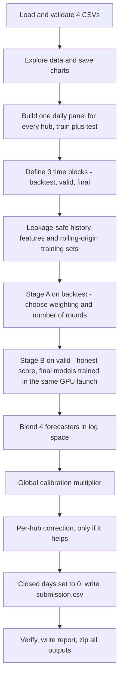

The notebook has 20 numbered sections. They are grouped below into 13 easy steps.

### Step 1. Setup, hardware and data loading

Notebook sections 1 to 4.

- **One config object.** Every setting (seed, window sizes, model parameters) is in one
  `CFG` object in Section 1, so a run is fully described in one place. The master seed is
  `42`; the four XGBoost seeds are 42, 43, 44 and 45.
- **GPU check.** Instead of trusting `nvidia-smi`, the notebook trains a tiny throw-away
  XGBoost model on each GPU. A GPU is used only if that works. CatBoost is tested the same way
  in a separate process. This run found `cuda:0` and `cuda:1` and used 4 worker slots (2 per
  GPU). Versions: Python 3.12.13, XGBoost 3.2.0, CatBoost 1.2.10, pandas 2.3.3, NumPy 2.0.2
  (`metrics/environment.json`).
- **Find the files.** The CSVs are searched for by name, so the notebook works with any
  Kaggle dataset name.
- **Check the data.** 13 checks are run and saved to `metrics/data_validation.json`. All 13
  passed. Examples: no duplicate hub-day rows, test dates start the day after training ends,
  every test hub exists in training and in the metadata, and **closed days always have zero
  orders** (0 exceptions).
- **Important finding.** `AppSessions` exists only in the training file. So it is never used
  as a daily input; it is only used as a hub-level summary of the past.

### Step 2. Exploring the data

Notebook section 5. All charts are saved in [solari_forecast/figures/](solari_forecast/figures/).

**Target overview.**

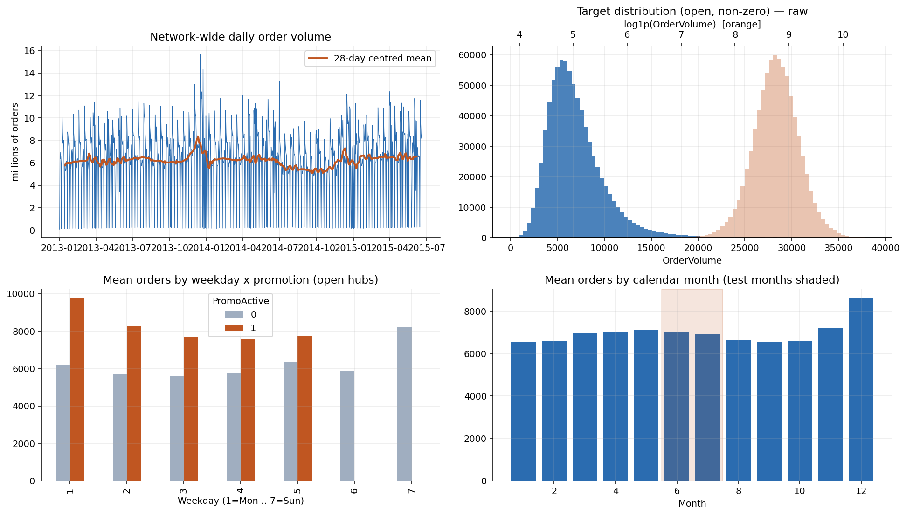

- Top left: network orders per day. The deep drops are Sundays and holidays when most hubs
  close. The 28-day average is steady at around 6 million orders a day, with a peak around
  December.
- Top right: daily orders are skewed to the right (skew 1.59). After `log1p` the shape is
  almost symmetric (skew -0.11). This confirms that training on the log scale is the right
  choice.
- Bottom left: promotions clearly lift orders on every weekday.
- Bottom right: the average by month. The test months (June and July) are shaded.

Key numbers (`metrics/target_summary.json`):

| Fact                                         | Value                             |
| -------------------------------------------- | --------------------------------- |
| Training rows                                | 970,379                           |
| Closed rows                                  | 166,269 (17.1%)                   |
| Open days with zero orders (data oddities)   | 54                                |
| Rows used for training (open and orders > 0) | 804,056                           |
| Mean daily orders on open days               | 6,955                             |
| Smallest and largest hub average             | 2,707 and 21,803 (about 8x apart) |
| Share of days with a promo, train vs test    | 38.3% vs 35.7%                    |

**Coverage and train/test differences.**

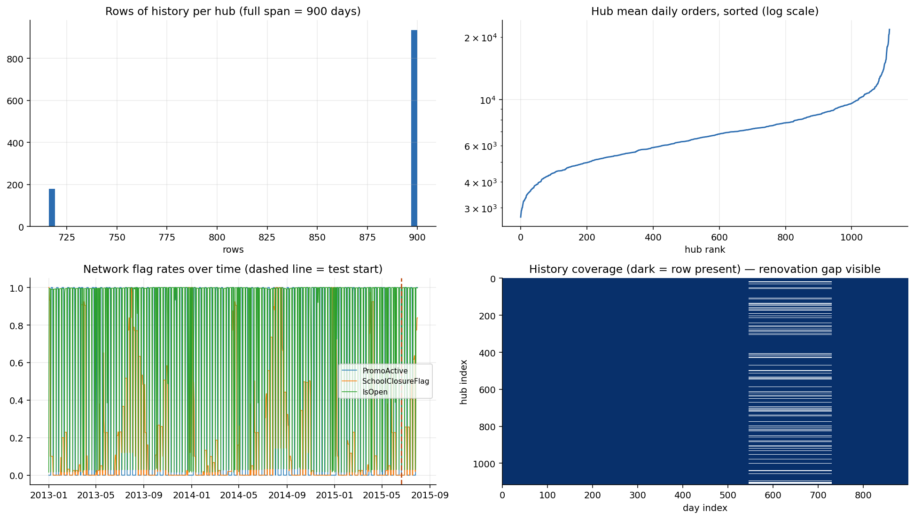

- 180 hubs have a block of missing days of up to 185 days (the renovation closures). They
  show up as white lines in the bottom-right heat strip and as the small bar at 716 rows in
  the top-left chart.
- **The test window has no regional holidays at all**, while training has 31,050 holiday
  rows. School closures are much more common in the test window (28.5%) than in the last 42
  training days (7.5%) (`metrics/train_test_shift.json`). This matters a lot later: model
  choices are made on "test-like" days with no holiday nearby.

**Hub metadata.**

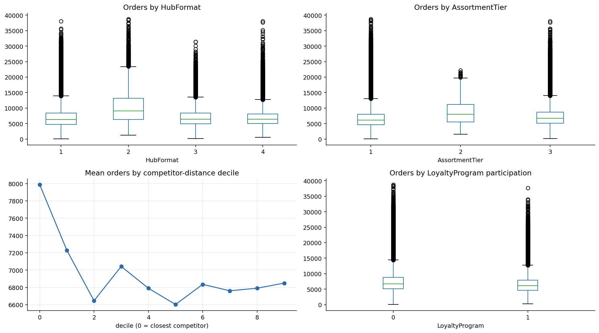

- Hub format 2 is the busiest on average (10,206 orders a day) but only 17 hubs use it.
- Hubs with a very close competitor (decile 0) have the highest average orders.
- Cleaning done here: 3 missing competitor distances filled with the median (2,325 m) and
  flagged; 354 hubs with no known competitor opening date kept as missing and flagged; the
  loyalty month list (for example "Mar,Jun,Sept,Dec") turned into 12 month flags
  (`metrics/hub_metadata_summary.json`).

**App sessions.**

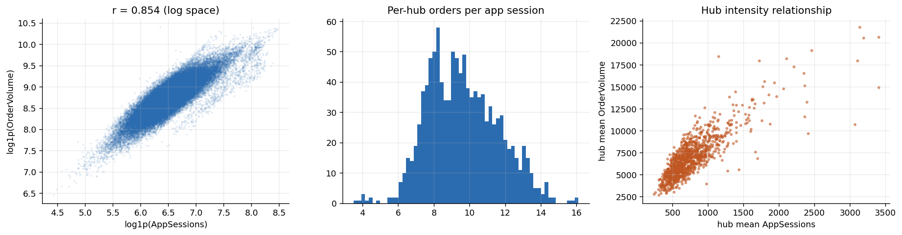

App sessions and orders move together strongly (correlation 0.854 on the log scale). A hub
converts, on average, about 9.6 orders per app session (5th to 95th percentile: 6.8 to 13.1).
Because the test file has no sessions, only hub-level averages from the past are used
(`metrics/appsessions_summary.json`).

### Step 3. Building one big table of features

Notebook section 6.

The notebook stacks train and test into a single table with **one row per hub per day** from
2013-01-01 to the end of the test window (about 1.07 million rows). Missing renovation days
are filled in and marked as closed, so counters such as "days since last closure" do not jump
over the gap.

It then adds features that are known in advance for the test window, because they come from
the business plan:

- **Promo features:** is there a promo today, how long the current promo has run, days since
  the last promo and until the next one.
- **Opening features:** days since or until a closed day, how long the hub has been open in a
  row, closed yesterday or tomorrow, number of closed days in the last and next 7 days
  (demand is pulled forward before a closure and released after it).
- **Holiday and school features:** the same idea for holidays and school closures.
- **Calendar features:** weekday, month, week of year, day of year, days to month end.
- **Hub metadata:** format, assortment, competitor distance and age, loyalty timing.
- **Inferred regions:** 12 regional groups found from hubs that share identical holiday and
  school-closure calendars.
- **Lag features for the direct models:** built by a helper `gap_lags(G)` so that every lag
  window ends exactly `G` days before the row.

### Step 4. How the model is tested fairly

Notebook section 7.

A random train/test split would let the model peek at days right next to the ones it is
graded on. Instead the notebook copies the real situation: **history ends, then forecast 42
unseen days**. It does this three times.

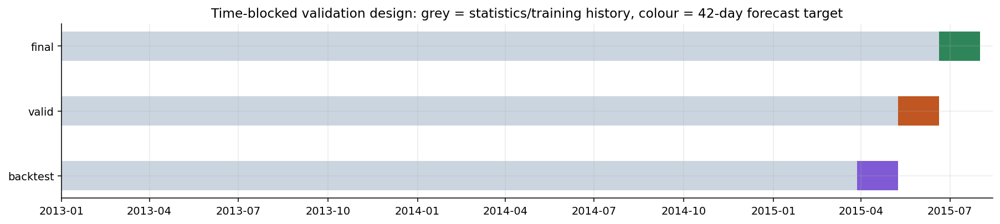

| Block     | History used     | Days forecast            | Used for                                        |
| --------- | ---------------- | ------------------------ | ----------------------------------------------- |
| back-test | up to 2015-03-27 | 2015-03-28 to 2015-05-08 | choosing settings (number of rounds, weighting) |
| valid     | up to 2015-05-08 | 2015-05-09 to 2015-06-19 | the honest score                                |
| final     | up to 2015-06-19 | 2015-06-20 to 2015-07-31 | the submission                                  |

Every block is exactly 42 days, the same as the test window (`metrics/validation_blocks.json`).

**Test-like rows.** The test window has no holidays, but both held-out blocks contain some
(Easter, Ascension, Whit Monday, Corpus Christi). So blend weights, calibration and the per-hub
correction are all chosen on rows with **no regional holiday within 3 days**, to match the test
window.

### Step 5. History features without cheating

Notebook section 8. This is the heart of the model.

The test window has no orders at all, so "yesterday's orders" cannot be used for day 30 of the
forecast. Instead each row gets a **summary of its hub's past**, always computed from data that
ends **before** the forecast window starts:

1. **Hub level:** average, median, spread, quartiles of log orders; app-session averages;
   open, promo and school-closure rates; days since the hub last traded.
2. **Averages by situation:** hub x weekday, hub x promo, hub x weekday x promo, hub x month,
   hub x school closure. Small groups are pulled towards the hub average (shrinkage with a
   prior of 12 days) so that a rarely seen combination cannot produce a wild value.
3. **Differences:** each situation average is also given as a difference from the hub average,
   which trees find easier to use.
4. **Recent levels:** averages over the last 7, 28, 91, 182 and 365 days, plus trend terms.
   These tell the model the hub's **current** level.
5. **Horizon:** how many days ahead the row is, so the model learns how much to trust recent
   levels.

In total there are **128 features** (`metrics/block_datasets.json`).

**Rolling origins.** To train the model, the notebook walks backwards in 42-day windows. Each
window's features are built only from the history before that window. This way no training
row ever helps compute its own feature, which removes the classic target-encoding leak. Older
rows get less weight (half-life of 365 days).

| Block     | Training windows | Training rows | Training dates           |
| --------- | ---------------- | ------------- | ------------------------ |
| back-test | 15               | 558,536       | 2013-07-06 to 2015-03-27 |
| valid     | 16               | 595,580       | 2013-07-06 to 2015-05-08 |
| final     | 17               | 633,052       | 2013-07-06 to 2015-06-19 |

**Leakage audit** (Section 8.2, `metrics/leakage_audit.json`). Three checks per block, all
passed:

- the newest training date is always older than the first forecast date;
- the hub average stored in the features, recomputed from the raw CSV, matches to within
  about 7.7e-7;
- every hub-level feature has exactly one value per hub across the forecast window.

If any check failed, the notebook would stop before writing a submission.

### Step 6. Training many models on two GPUs

Notebook section 9.

One XGBoost model does not keep a T4 GPU fully busy. So the notebook runs **many small jobs at
the same time**: 2 worker processes per GPU, 4 in total, fed from one shared queue with the
longest jobs first. Each worker is a separate Python process running
[solari_forecast/xgb_worker.py](solari_forecast/xgb_worker.py) (written by the notebook). Workers
report progress back as text lines, which the notebook turns into live progress bars. If a
worker fails, the run stops with the real error message.

### Step 7. The four forecasters

Notebook sections 9 to 10.4. All four predict `log1p(OrderVolume)`.

| Forecaster                            | Idea in one line                                                                                                         | Key settings                                         |
| ------------------------------------- | ------------------------------------------------------------------------------------------------------------------------ | ---------------------------------------------------- |
| **XGBoost rolling-origin**            | Uses the leakage-safe hub history features from Step 5                                                                   | 4 seeds, depth 10, learning rate 0.02                |
| **XGBoost multi-gap direct**          | Six models, each allowed lags that are 7, 14, 21, 28, 35 or 42 days old; each forecast day uses the freshest lags it can | 127 leaves, `HubID` as a category, pseudo-Huber loss |
| **CatBoost direct**                   | A different kind of tree model, for variety                                                                              | gaps 14 and 42, depth 8                              |
| **XGBoost direct, no lags** ("plain") | Only `HubID`, calendar and metadata, no lag noise at all                                                                 | same learner as multi-gap                            |

**Why multi-gap?** A model that may only use 42-day-old data wastes information when
forecasting tomorrow. With six gap models, days 1 to 7 use 7-day-old lags, days 8 to 14 use
14-day-old lags, and so on.

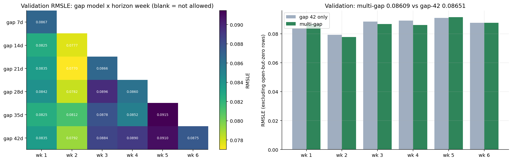

- Left: validation RMSLE of each gap model for each week it is allowed to serve.
- Right: stitching the six models together scores **0.08623** versus **0.08702** for the
  single gap-42 model (validation, excluding open-but-zero rows, `metrics/multigap.json`).

### Step 8. Stage A: tuning on the back-test block

Notebook section 11, `metrics/stage_a_ablation.json`.

Settings are chosen on the **earlier back-test block** so that the validation block stays
untouched and its score stays honest.

- **Recency weighting:** weighted training scored 0.08090 on test-like back-test rows versus
  0.08155 unweighted, so weighting is kept.
- **Number of rounds:** early stopping picked 1,012 rounds for the rolling-origin XGBoost.
  Round counts for every direct model were chosen the same way (for example 1,420 for gap 7 up
  to 2,348 for gap 42).
- **Multi-gap tree size:** 127 leaves (mean 0.08820) beat 255 leaves (0.08880), so 127 is kept.

### Step 9. Stage B: honest validation score

Notebook section 12, `metrics/stage_b_validation.json`.

The rolling-origin XGBoost is trained on the validation block with a **fixed** 1,012 rounds
(no early stopping on the block being scored). Four seeds are averaged in log space:

| Seed | Single-model RMSLE | Running ensemble RMSLE |
| ---- | ------------------ | ---------------------- |
| 42   | 0.09870            | 0.09870                |
| 43   | 0.09785            | 0.09791                |
| 44   | 0.09829            | 0.09780                |
| 45   | 0.09758            | 0.09758                |

The 4-seed ensemble gains 0.00053 over the average single model. The four seeds agree very
closely (mean pairwise correlation 0.998, `metrics/model_agreement.json`).

To save time, all **final** models are trained in this same GPU launch, since their round
budgets are already fixed.

**Baselines on the same validation block** (`metrics/baselines.json`):

| Baseline                      | RMSLE       |
| ----------------------------- | ----------- |
| Global average                | 0.36564     |
| Hub average                   | 0.23417     |
| Hub x weekday average         | 0.18407     |
| Hub x weekday x promo average | 0.14544     |
| **Final pipeline**            | **0.09432** |

### Step 10. Blending, calibration and per-hub correction

Notebook sections 12.1 to 12.4.

**Blend.** The four forecasts are combined as a weighted average in log space. Every weight
combination in steps of 0.05 is tried, and the one with the lowest combined error on the
test-like rows of both held-out blocks wins.

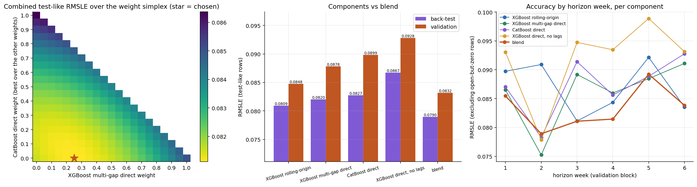

Chosen weights (`metrics/blend.json`):

| Forecaster               | Weight | Validation RMSLE (all rows) | Validation RMSLE (test-like) |
| ------------------------ | ------ | --------------------------- | ---------------------------- |
| XGBoost rolling-origin   | 0.55   | 0.09758                     | 0.08475                      |
| XGBoost multi-gap direct | 0.25   | 0.09691                     | 0.08785                      |
| CatBoost direct          | 0.00   | 0.09772                     | 0.08986                      |
| XGBoost direct, no lags  | 0.20   | 0.10187                     | 0.09279                      |
| **Blend**                |        | **0.09429**                 | **0.08319**                  |

The blend beats every single forecaster. CatBoost was trained but received a weight of 0 in
this run, so it does not affect the submission.

**Global calibration.** One multiplier is applied to all predictions. The notebook tries
0.940 to 1.110 and picks the value that is best on both blocks together. It is accepted only
if both blocks agree on a similar optimum.

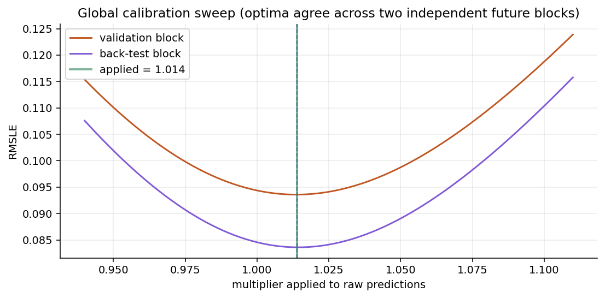

The applied multiplier is **1.012** (`metrics/calibration.json`). It lowers test-like
validation RMSLE from 0.08319 to 0.08200.

**Per-hub correction.** The notebook also tested adding a small fixed offset per hub, learnt
from the previous block's errors. It made validation slightly worse (gain -0.00020, needed
+0.0001), so it was **not applied** (`metrics/hub_correction.json`).

### Step 11. Checking where the model is right and wrong

Notebook sections 13 to 15.

**Diagnostics on the validation block.**

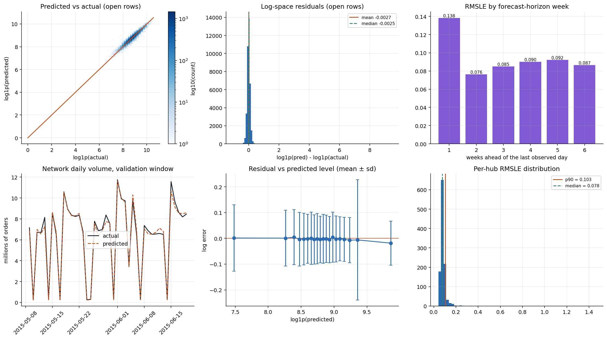

- Top left: predictions sit tightly on the diagonal against actuals.
- Top middle: errors are centred near zero (mean +0.0062 on open rows).
- Top right: RMSLE by forecast week. Week 1 is the hardest (0.137); weeks 2 to 6 range from
  0.079 to 0.089.
- Bottom left: network total per day, actual versus predicted, over the validation window.
- Bottom middle: no systematic bias between small and large predicted volumes.
- Bottom right: most hubs score near the median of 0.075; the 90th percentile is 0.099.

**Scores by segment** (`metrics/validation_segments.csv`, all rows):

| Segment        | Value                 | RMSLE                                         |
| -------------- | --------------------- | --------------------------------------------- |
| Promo day      | yes / no              | 0.0860 / 0.0986                               |
| School closure | yes / no              | 0.1829 / 0.0832                               |
| Hub format     | 1 / 2 / 3 / 4         | 0.0817 / 0.1065 / 0.1475 / 0.0845             |
| Renovation hub | yes / no              | 0.0879 / 0.0955                               |
| Weekday        | Friday (5) is worst   | 0.1533                                        |
| Horizon week   | 1 / 2 / 3 / 4 / 5 / 6 | 0.137 / 0.083 / 0.079 / 0.082 / 0.089 / 0.082 |

**Feature importance.**

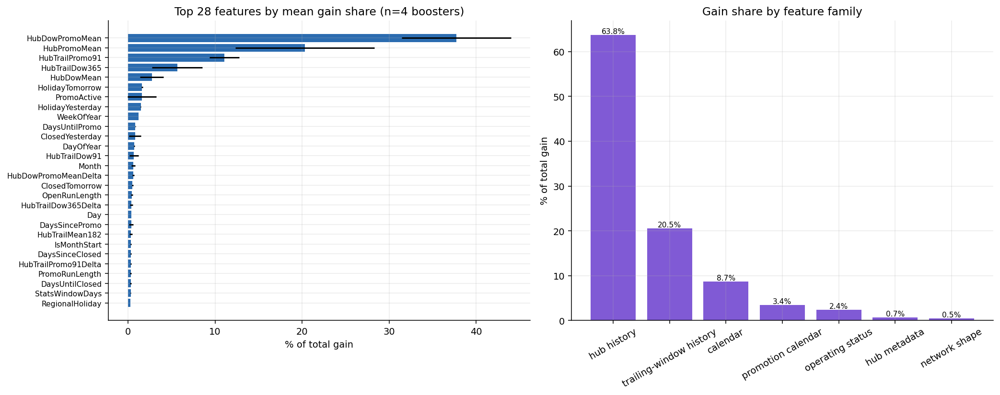

The model mostly relies on "how busy is this hub on this weekday with or without a promo":
`HubDowPromoMean` alone carries 29% of the total gain and the top 5 features carry 71%
(`metrics/feature_importance.csv`). By family: hub history 53.9%, trailing-window history
26.0%, calendar 11.7%, promotion calendar 5.3%, others under 2% each.

**Error analysis** (`metrics/error_analysis.json`, `metrics/worst_hubs.csv`).

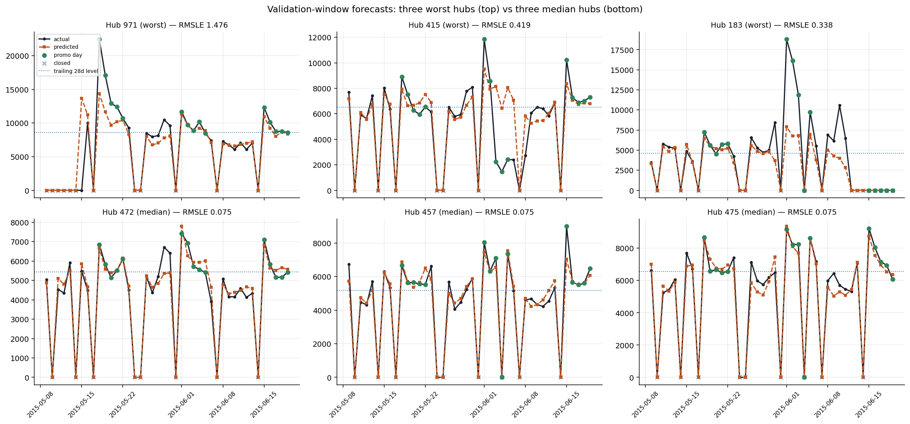

- Errors are concentrated: the **worst 1% of rows carry 35.8%** of the total squared log error.
- Top row: the three worst hubs. Hub 971 (RMSLE 1.478) was closed at the start of the window;
  around its reopening the forecast was about 13,800 orders on a day with near-zero actual
  orders. Hub 415 dropped to about 2,000 orders for several days in early June while the
  forecast stayed near 8,000. Hub 183 spiked to about 18,800 orders on 2015-06-01, far above
  its forecast of about 8,600.
- Bottom row: three typical hubs (RMSLE 0.075), where the forecast follows the actual closely.
- The failures are mostly sudden level changes after the history ends, which a 42-day-ahead
  forecast cannot know about.

### Step 12. Stage C: final forecast and submission

Notebook sections 16 to 18.

- **Final models** are trained on all history up to 2015-06-19 (633,052 training rows for the
  rolling-origin model). They use the round counts from Stage A multiplied by 1.1, because
  they see more data (for example 1,012 x 1.1 = 1,113 rounds).
- The exact validation pipeline is applied: blend, then calibration x1.012, then closed days
  set to 0.
- **Sanity checks before writing** (`metrics/test_prediction_checks.json`): all predictions
  finite and non-negative, closed rows exactly zero, and for 100% of hubs the forecast average
  is within 0.4x to 2.5x of the last 42 days (the actual range is 0.90x to 1.07x from the 1st to
  99th percentile).

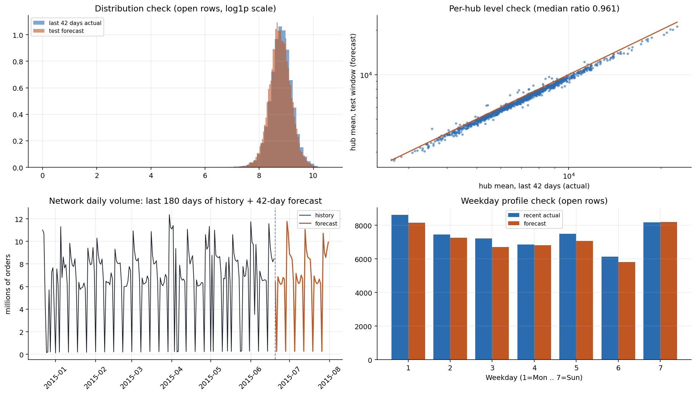

- Top left: forecast distribution matches the last 42 days of actuals.
- Top right: each hub's forecast level against its recent level; the median ratio is 0.961.
- Bottom left: the forecast continues the historical weekly pattern.
- Bottom right: weekday profile of the forecast against recent actuals.

**Submission.** `submission.csv` is built by joining predictions onto
`sample_submission.csv`, rounding to whole orders, and saving. It is then re-read from disk and
verified (`metrics/submission_verification.json`): correct columns, integer type, 46,830 rows,
same Ids and order as the sample, no nulls, no negatives, no duplicates, and **zero predictions
exactly on the 6,548 closed test rows**. All checks passed.

Test forecast summary (`metrics/stage_c_final.json`): mean 6,002 orders per row, median 5,938,
maximum 30,310 (historical maximum 38,722).

### Step 13. Reports and the output ZIP

Notebook sections 19 to 20.

- `reports/run_config.json` records every setting, the chosen values and library versions.
- [solari_forecast/reports/summary.md](solari_forecast/reports/summary.md) is a 1-2 page
  write-up generated from this run's numbers, as required by the rules.
- The last cell checks that all 44 required files exist, skips large temporary files, zips
  everything into `solari_forecast_<run tag>.zip`, tests the ZIP and prints download links.

## Output files reference

All paths are inside [solari_forecast/](solari_forecast/).

| File                                               | What it contains                                                     |
| -------------------------------------------------- | -------------------------------------------------------------------- |
| `metrics/environment.json`                         | Python and library versions, GPUs, seed                              |
| `metrics/data_validation.json`                     | The 13 input data checks                                             |
| `metrics/target_summary.json`                      | Target statistics, closed and zero rows                              |
| `metrics/train_test_shift.json`                    | Renovation gaps, flag rates train vs test                            |
| `metrics/hub_metadata_summary.json`                | Metadata cleaning and averages by group                              |
| `metrics/appsessions_summary.json`                 | Sessions vs orders relationship                                      |
| `metrics/validation_blocks.json`                   | Dates of the three blocks                                            |
| `metrics/block_datasets.json`                      | Training windows, rows and features per block                        |
| `metrics/leakage_audit.json`                       | Results of the three leakage checks                                  |
| `metrics/baselines.json`                           | Naive baseline scores                                                |
| `metrics/stage_a_ablation.json`                    | Weighting and round choices                                          |
| `metrics/stage_b_validation.json`                  | Per-seed validation scores                                           |
| `metrics/multigap.json`                            | Multi-gap rounds and per-week scores                                 |
| `metrics/blend.json`                               | Blend weights, component scores, full weight grid                    |
| `metrics/calibration.json`                         | Calibration curves and chosen multiplier                             |
| `metrics/hub_correction.json`                      | Per-hub correction test (not applied)                                |
| `metrics/validation_overall.json`                  | Overall validation metrics (RMSLE, MAE, RMSE, MAPE, bias, R squared) |
| `metrics/validation_segments.csv`                  | Metrics by segment                                                   |
| `metrics/validation_per_hub.csv`                   | RMSLE for every hub                                                  |
| `metrics/feature_importance.csv`                   | Gain importance of all features                                      |
| `metrics/model_agreement.json`                     | Agreement between seeds, gain by family                              |
| `metrics/error_analysis.json`                      | Error concentration and hypothesis tests                             |
| `metrics/worst_hubs.csv`, `metrics/worst_rows.csv` | The worst 15 hubs and 25 rows                                        |
| `metrics/stage_c_final.json`                       | Final model settings and test prediction summary                     |
| `metrics/test_prediction_checks.json`              | Sanity checks on the test forecast                                   |
| `metrics/submission_verification.json`             | Checks on the written submission                                     |
| `predictions/test_predictions_per_model.csv`       | Test predictions from each final model                               |
| `predictions/test_predictions_detailed.csv`        | Test predictions with row context                                    |
| `models/*.meta.json`, `models/*.pred.npy`          | Per-model settings, importances and predictions                      |
| `logs/run.log`                                     | Timestamped log of the whole run                                     |
| `logs/worker_cuda*.log`                            | GPU worker output                                                    |

## Technology stack

Versions are from the Kaggle run (`metrics/environment.json`).

| Technology       | Version       | Purpose in this project                                          |
| ---------------- | ------------- | ---------------------------------------------------------------- |
| Python           | 3.12.13       | Runs the notebook                                                |
| XGBoost          | 3.2.0         | Rolling-origin, multi-gap and plain forecasters, on GPU (`cuda`) |
| CatBoost         | 1.2.10        | Direct CatBoost forecaster on GPU                                |
| pandas           | 2.3.3         | Loading data, building the panel and features                    |
| NumPy            | 2.0.2         | Numeric work, log transforms, metrics                            |
| matplotlib       | 3.10.0        | All figures                                                      |
| tqdm             | not recorded  | Live progress bars                                               |
| pyarrow          | not recorded  | Parquet files handed to the GPU workers (via pandas)             |
| Kaggle GPU T4 x2 | 2 x NVIDIA T4 | Hardware for training; 2 worker processes per GPU                |

## Configuration

All settings are in the `CFG` object in notebook Section 1. The most important ones:

| Setting                 | Value                 | Meaning                                                       |
| ----------------------- | --------------------- | ------------------------------------------------------------- |
| `SEED`                  | 42                    | Master seed; model seeds are 42 + i                           |
| `VALID_DAYS`            | 42                    | Length of every held-out block, same as the test window       |
| `N_SEEDS_GPU`           | 4                     | Rolling-origin XGBoost seeds when GPUs are present (2 on CPU) |
| `MG_GAPS`               | 7, 14, 21, 28, 35, 42 | Lag gaps of the multi-gap models                              |
| `CAT_GAPS`              | 14, 42                | Lag gaps of the CatBoost models                               |
| `TRAIL_WINDOWS`         | 7, 28, 91, 182, 365   | Recent-level windows in days                                  |
| `SMOOTH_PRIOR`          | 12.0                  | Shrinkage strength for group averages                         |
| `RECENCY_HALFLIFE_DAYS` | 365.0                 | Half-life of training sample weights                          |
| `FINAL_ROUND_INFLATION` | 1.10                  | Extra rounds for final models                                 |
| `BLEND_STEP`            | 0.05                  | Step of the blend weight search                               |
| `CALIB_GRID`            | 0.940 to 1.110        | Calibration multipliers tried                                 |
| `DIRECT_FINAL_SEEDS`    | 1                     | Seeds per final direct model                                  |
| `WORKERS_PER_GPU`       | 2                     | Parallel worker processes per GPU                             |

The notebook does not use environment variables or secrets.

## Reproducibility

- **Seeds:** fixed and disclosed (`SEED = 42`, models use 42 to 45). `PYTHONHASHSEED`,
  `random` and `numpy` are all seeded.
- **End-to-end:** the notebook runs from raw CSVs to `submission.csv` and the ZIP with no
  manual steps.
- **GPU note:** GPU tree training can differ in the last decimal places between runs and
  hardware, so a re-run may not match these numbers exactly.
- **Record:** `reports/run_config.json` and `metrics/environment.json` capture the settings
  and versions of each run.

## Troubleshooting

| Problem                                   | Likely cause                                     | How to check                                                | Fix                                                        |
| ----------------------------------------- | ------------------------------------------------ | ----------------------------------------------------------- | ---------------------------------------------------------- |
| `Could not locate: orders_train.csv ...`  | Data not attached or not under a searched folder | Look at the folder listing printed in the error             | Attach the dataset on Kaggle, or put the CSVs in `./data/` |
| Only 2 blend components, CatBoost skipped | No working GPU, or CatBoost not installed        | Check `USE_CATBOOST` and `GPU_DEVICES` printed in Section 2 | Use GPU T4 x2 on Kaggle; install `catboost`                |
| `RuntimeError` from a worker              | A GPU job crashed                                | Read `solari_forecast/logs/worker_<device>.err.log`         | Fix the cause shown in the log and re-run                  |
| An `assert` fails in Section 4 or 8.2     | Input data changed or a leakage check failed     | Read the assertion message                                  | Do not bypass it; the check protects the submission        |
| Run takes far longer than an hour         | Running on CPU                                   | Section 2 output shows no GPU devices                       | Enable the GPU accelerator                                 |

## Known limitations

- **No holidays in the test window.** Holiday features help explain the past but cannot help
  in the test window. Model choices use holiday-free rows to account for this.
- **Sudden level changes.** A forecast made 42 days ahead cannot react to changes that start
  after the history ends. This is the main source of the largest errors.
- **Calibration is slightly optimistic.** The multiplier is fitted using the validation block,
  so the validation score is marginally optimistic. The back-test block agreeing on the same
  optimum limits this.
- **Week 1 is the weakest horizon week** (RMSLE 0.137 vs 0.079 to 0.089 for later weeks). The
  notebook does not break down the reason further.
- **Not verified outside Kaggle.** The local fallback path has not been run for this
  repository, and no dependency file is provided.
- **Small inconsistencies in generated text.** The auto-generated `reports/summary.md` says
  the first week after a closure is "harder", but its numbers show a lower RMSLE for that week
  (0.1048) than for settled days (0.1207). A notebook note mentions 181 renovation hubs while
  the measured count is 180. The notebook's time estimate (70 to 80 minutes) is longer than the
  logged run (about 61 minutes).
- **Leaderboard score:** Not measured in the current repository.
